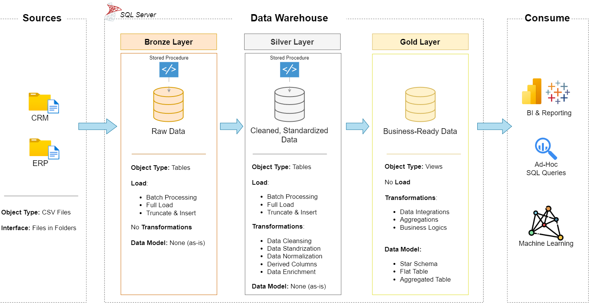

# SQL-Data-Warehouse-Project
Welcome to the Data Warehouse and Analytics Project repository! 🚀
This project demonstrates a comprehensive data warehousing and analytics solution, from building a data warehouse to generating actionable insights. Designed as a portfolio project, it highlights industry best practices in data engineering and analytics.

## 🏗️ Data Architecture

The data architecture for this project follows the **Medallion Architecture** with **Bronze**, **Silver**, and **Gold** layers.

1. **Bronze Layer:** Stores raw data imported from the source systems.
2. **Silver Layer:** Cleans, standardizes, and transforms the data.
3. **Gold Layer:** Creates business-ready data for reporting and analytics.

## 📖 Project Overview

This project involves:

1. **Data Architecture:** Designing a modern Data Warehouse using the Medallion Architecture (Bronze, Silver, Gold).

2. **ETL Pipelines:** Extracting, transforming, and loading data from source systems into the warehouse.

3. **Data Modeling:** Developing fact and dimension tables optimized for analytical queries.

4. **Analytics & Reporting:** Creating SQL-based reports and dashboards for business insights.

---

🎯 This repository demonstrates skills in:

- SQL Development
- Data Warehousing
- ETL Development
- Data Modeling
- Database Design
- Data Analytics
- SQL Server

# 🚀 Project Requirements

## Building the Data Warehouse (Data Engineering)

### Objective
Develop a modern data warehouse using SQL Server to consolidate sales data for analytics.

### Specifications

- **Data Sources:** Import data from ERP and CRM CSV files.
- **Data Quality:** Clean and standardize the data.
- **Integration:** Combine all sources into one data model.
- **Scope:** Use the latest dataset.
- **Documentation:** Document the data model.

## BI: Analytics & Reporting (Data Analysis)

### Objective
Develop SQL-based analytics to provide insights into:

- Customer Behavior
- Product Performance
- Sales Trends

### 🛡️ License
This project is licensed under the [MIT License](https://github.com/DataWithBaraa/sql-data-warehouse-project/blob/main/LICENSE). You are free to use, modify, and share this project with proper attribution.

## 👨‍💻 About Me

Hi, I'm Qais. I am passionate about Data Analytics, AI, and building data-driven solutions. I am improving my skills in SQL, Data Warehousing, and Machine Learning through practical projects.
